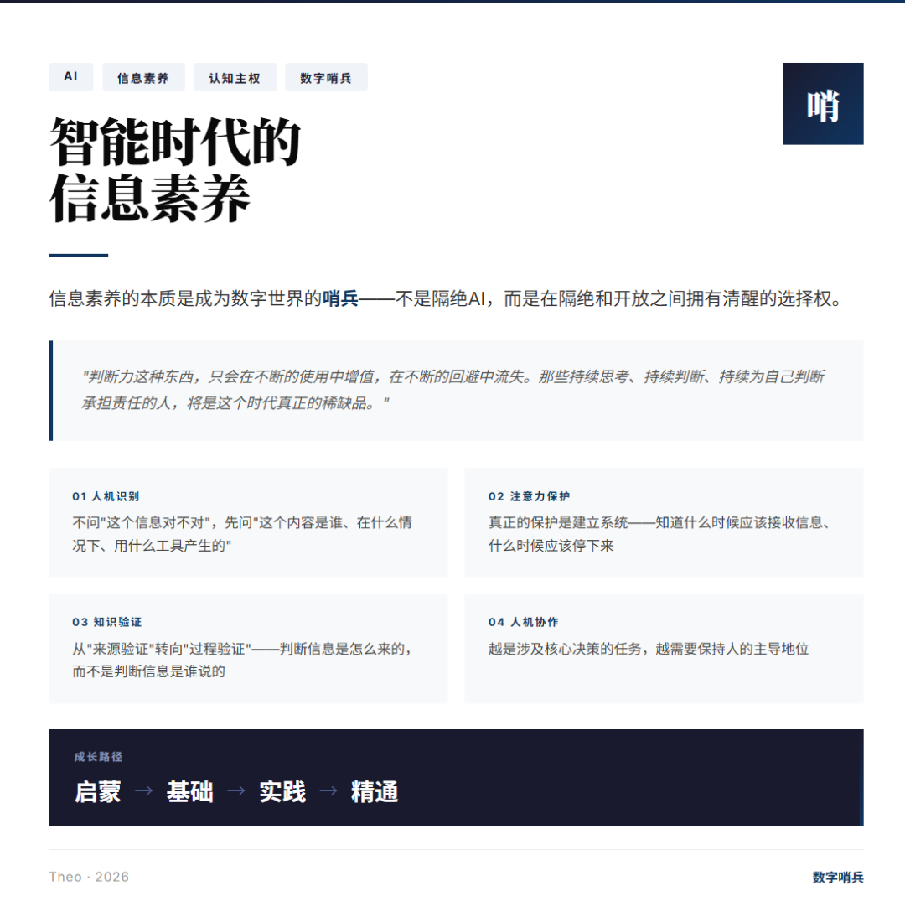

你上一次相信自己眼睛的时候，是什么时候？

不是哲学意义上的追问，而是字面意思——你刷到一个视频，看到一段录音，读到一篇文章，你有多大把握确认那些画面是真的、那个声音没被处理过、那篇文章不是AI写的？

这个问题在五年前还不需要问。那时候信息的门槛很低，生成成本很高，伪造得不偿失。现在不一样了。一段几秒钟的语音可以被完整克隆，一段视频可以换掉其中任何一帧而不留痕迹，一篇文章可以在一秒内生成且读起来像人写的。

**传统信息素养的框架正在失效。** 过去五十年，信息素养教育的核心是"找到信息-评估信息-使用信息"的三件套。这套体系建立在三个假设之上：信息相对稀缺、来源相对可追溯、处理相对单向。

在AI可以无限量生产"看起来像真的"内容的世界里，这三个假设全部崩塌。

那么，AI时代的信息素养究竟是什么？

我提炼出了四根独立的底层机制：**人机识别、注意力保护、知识验证、人机协作**。这四根机制缺一不可，它们共同指向一个核心目标——守护认知自主性。

换句话说，**信息素养的本质是成为数字世界的哨兵。**

---

## 信息素养的底层架构

### 一：人机识别的能力

人类大脑在社会进化中形成了一套认知捷径——我们倾向于相信对话背后有意识、有意图、有立场。这套机制在过去几百万年里运作良好，因为每次对话背后确实都是人。

但大语言模型LLM改变了一切。你跟一个客服聊了十分钟，感觉对方专业、耐心、善于倾听，然后对方说"这个问题需要转接专员"，电话断了，你事后才知道那是AI。

真正有效的人机识别，不能依赖"AI有时候会露馅"的侥幸。模型越强，露馅的概率越低。它需要一套系统化的认知策略：对AI能力边界有多少了解、对AI常见"指纹"有没有感知、以及在信息处理流程中有没有嵌入"来源确认"的习惯。

**不问"这个信息对不对"，先问"这个内容是谁、在什么情况下、用什么工具产生的"。**

### 二：注意力保护的能力

注意力经济的逻辑很简单：你的注意力是一种可以被出售的商品。平台通过算法预测什么内容能让你停留更久、点击更多，然后把这种预测能力卖给广告主。

AI来了之后，这套游戏的规模变了——内容生成的边际成本趋近于零。AI可以根据你的每一次点击、每一次停顿、每一次情绪波动，实时调整推送策略，精准地找到让你停下来的那个参数组合。

**注意力保护不是意志力问题。** 意志力是消耗品，消耗完就会崩塌。真正的保护是建立系统：你得知道自己什么时候应该接收信息、什么时候应该停下来，知道什么信息对你真正重要。

算法比你更清楚什么内容能让你停留，但它不知道什么是真正重要的——因为真正重要的东西往往不是让你最舒服的。

### 三：知识验证的能力

有一项研究让参与者判断三篇文章的可信度，一篇来自匿名用户，一篇来自小型独立网站，一篇来自《纽约时报》。大多数参与者把《纽约时报》评为最可信。然后研究人员透露：这三篇中有一篇是AI写的，而可信度评级与来源并不相关。

**我们判断信息的依据往往是"谁说的"，而不是"说的什么"。**

在AI时代，这套框架正在失效。AI可以把任何内容嵌入任何来源标签后面——看起来像权威机构发布的数据、看起来像学术引用的结构。

知识验证需要从"来源验证"转向"过程验证"：判断信息是怎么来的，而不是判断信息是谁说的。

### 四：人机协作的能力

这是最重要的一根线，也是最少被讨论的。

AI是工具。但工具会改变使用它的人。你会用AI提升效率，但你会失去什么？你会用AI帮你思考，但你的思考能力会退化吗？

有效的人机协作需要先想清楚三个问题：AI擅长什么、不擅长什么？人与AI的协作接口怎么设计？在什么情况下应该依赖AI，在什么情况下应该独立判断？

**越是涉及核心决策的任务，越需要保持人的主导地位。** 这不是对AI的贬低，而是对判断权归属的清醒认知。

---

## 认知重构：从技能组合到认知系统

传统信息素养框架将信息素养描述为一组可分离的技能：信息获取、信息评估、信息使用、信息伦理。

AI时代的信息素养框架需要从"技能组合"升级为"认知系统"。

四个机制不是四项独立的技能，而是相互依赖、动态交互的认知能力。你可以有出色的人机识别能力。但如果你注意力被算法劫持了，你就没有多余的认知资源来运用这种能力。

更重要的是，信息素养的关注点需要从"外部导向"转向"内部导向"。**如何管理自己的注意力资源、如何监控自己的认知过程、如何识别自己的判断何时被外部力量影响**——这种元认知能力，是AI时代信息素养的基石。

没有这种元认知，其他所有能力都建立在不稳定的基础上。

---

## 哨兵的隐喻

有个词叫 Sentinel，哨兵。

站在城墙最高处，眼睛盯着远方。不是为了自己，是为了保护身后的人。观察威胁，报告异常，守护安全。

**哨兵的价值不在于他打了多少敌人，而在于他能在威胁到达之前看到多少。**

这个比喻特别适合形容AI时代需要的信息素养。我们都需要成为信息哨兵——站在数字世界的边界上，守护自己的注意力、判断力和自主性。

哨兵不是将军，不需要赢得战争。哨兵只需要：**看得见威胁，守得住边界。**

---

## 成长路径

信息素养的发展可以分为四个阶段：

**启蒙阶段**——建立问题意识，理解为什么AI时代信息素养比以前更重要。

**基础阶段**——认识信息素养的四个机制各自是什么、为什么重要、它们之间如何关联。

**实践阶段**——在每天的信息消费中有意识地运用四个机制，建立反馈循环。

**精通阶段**——将信息素养内化为"自动运行"但"可被调取"的认知操作系统。

---

## 认知的边界

当然，这个框架不是万能的，有一定的边界。

**边界一：** 信息素养无法解决系统性信息操控——个人的信息素养能力无法抵御大型的信息作战行动。

**边界二：** 信息素养无法替代专业判断和领域知识——一个拥有高度信息素养的人，如果没有气候科学的背景，仍然可能被关于气候变化的误导性数据欺骗。

**边界三：** "过度素养"的危险。对信息的真实性、来源、可信度进行无休止的怀疑，是一种新型的认知瘫痪。真正有效的信息素养，不是怀疑一切，而是在信任和怀疑之间找到动态平衡。

---

## 对信息素养更高维度的思考

四个机制——人机识别、注意力保护、知识验证、人机协作——表面上是四种独立的能力，但它们共享同一个底层目标：维护个体在智能时代的主体性。

**人类最后的不对称优势，只剩下"判断力"本身**——知道自己是谁、想要什么、愿意为此承担什么后果。

这意味着信息素养的终极命题不是"如何不被AI骗"，而是"如何在AI时代仍然是一个完整的人"。

完整意味着：有能力识别什么是机器什么是人，但不被这个识别本身所累；有意识保护自己的注意力，但不至于因为过度防御而丧失与世界连接的能力；能够验证知识的真实性，但不至于陷入怀疑一切的虚无；能够与AI协作，但始终记得最终的判断属于自己。

**成为数字世界的哨兵，不是要建立一道隔绝AI的墙，而是要让自己在隔绝和开放之间，拥有清醒的选择权。**

这份选择权，就是AI时代信息素养的本质——它不是技能，是姿态；不是能力，是责任。

判断力这种东西，只会在不断的使用中增值，在不断的回避中流失。无论AI如何进化，有一点是确定的：

**那些持续思考、持续判断、持续为自己判断承担责任的人，将是这个时代真正的稀缺品。**

这不是预言，这是选择。
